<div align="center">


**A Windows 95 desktop for Apache Airflow 3.1+, shipped as a native plugin.**

[](https://airflow.apache.org)
[](LICENSE)
[](https://python.org)
[](https://github.com/roykoand/airflow-os-plugin/actions/workflows/ci.yml)

</div>

---

## What it is for

A desktop is a way of reading a system, and Windows 95's reading happens to fit
Airflow's almost exactly. Three things come out of taking that seriously:

- **It teaches the model.** Pools are a bounded resource tasks contend for, so they are
  memory. A dag run is a folder of task instances, so it browses. People who already
  know what a process table and a recycle bin mean can read Airflow's data model without
  being taught its vocabulary first.
- **It answers deployment-wide questions Airflow's UI asks you to go looking for.**
  Everything in flight, everything waiting on a human, and everything that missed a
  deadline, each in one window, across every dag at once.
- **It puts the agent inside the pipeline.** Clippy's triage is a real dag run — logged,
  retryable, auditable — not a chat box bolted to the side of one.

---

## The idea

Windows 95 and Airflow already have the same shape. Once you see it, the desktop stops
being a skin over Airflow and becomes a *reading* of it.

| Windows 95 | Airflow |
| --- | --- |
| Process | Task instance |
| PID | `TaskInstance.pid`, or a stable synthetic id |
| CPU usage | Running slots / `core.parallelism` |
| Memory usage | Occupied pool slots / total pool slots — pools *are* a bounded resource tasks contend for |
| Priority class | `priority_weight`, bucketed into Realtime…Low |
| Drive `C:` | The dag bundle |
| Folders | Dag → dag run → task instance |
| Files | Task logs, XCom values, rendered properties |
| Control Panel | Variables, Connections, Pools |
| Event Viewer | The audit log |
| Message box | A human-in-the-loop request |
| Unread mail | A missed deadline |
| Recycle Bin | Stale dags and removed task instances |
| Help book | A dag's `doc_md`; its pages are the tasks |
| Paint | The dag graph: tasks are boxes, their colour is the task instance state |
| Blue screen | A task that just failed |

---

## What's on the desktop

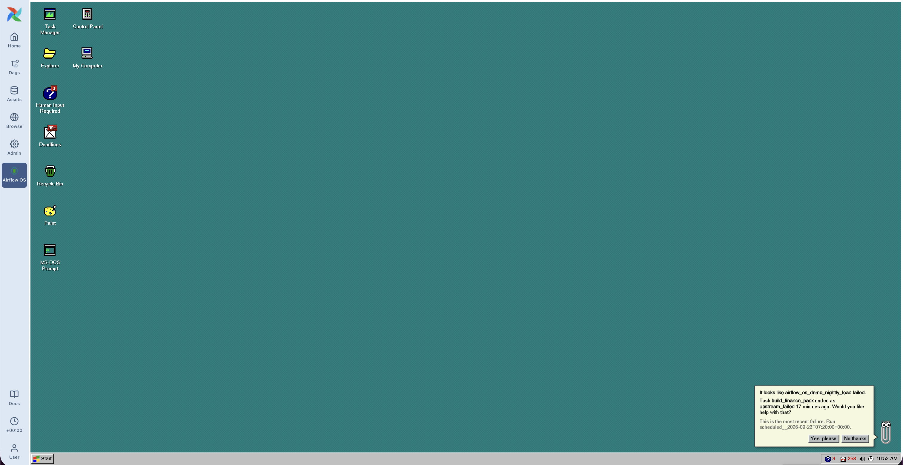

### Task Manager

Ctrl+Alt+Del for your scheduler. **Applications** are dag runs, **Processes** are task
instances, **Performance** graphs parallelism and pool-slot utilisation.

The CPU column is real: it is how far through its own historical mean duration a task
has got, so a task 30 seconds into a job that normally takes 60 reads as 50%. Tasks
with no history report nothing rather than a guess.

**End Process** fails the task instance — and deliberately does not cascade to
downstream tasks, because Windows 95 did not ask permission either.

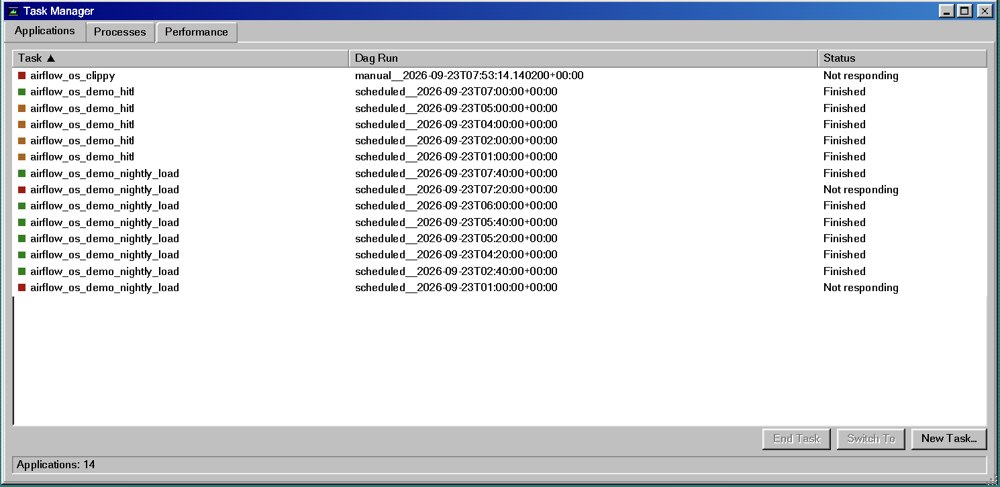

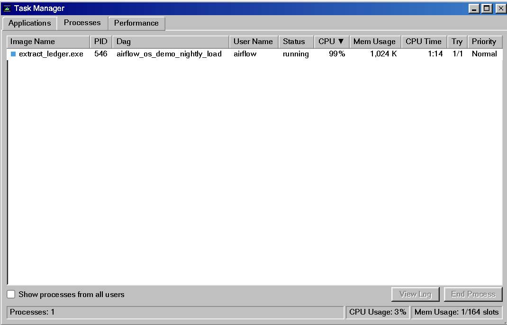

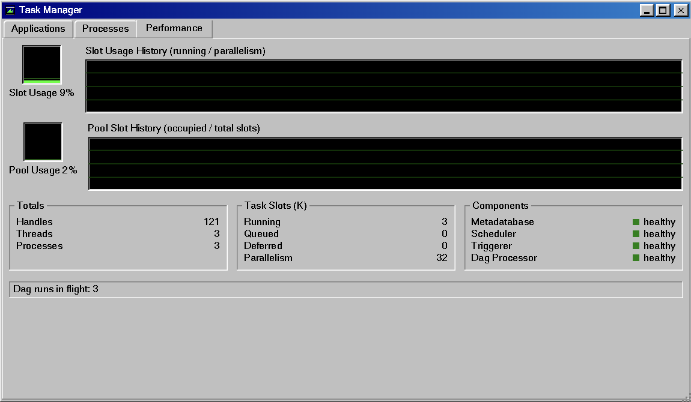

### Explorer, and Notepad

Airflow's own object graph, as a drive:

```
C:\<dag_id>\<run_id>\<task_id>\{stdout.log, xcom\, details.json}
```

Folders are dags, runs and task instances; files are logs, XCom values and rendered
properties. Double-click a log and it opens in Notepad, streamed from the public REST
API so it inherits whatever log handler the deployment configured.

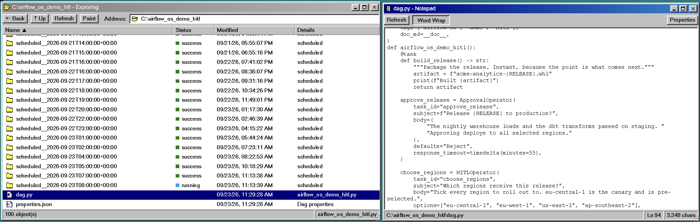

### Clippy

> *"It looks like airflow_os_demo_failure failed. Would you like help with that?"*

Clippy watches the process table and offers to triage the most recent failure.
Accepting triggers the `airflow_os_clippy` dag — **a real dag run you can watch in Task
Manager while he thinks** — which is one `@task.llm` step using the Common AI provider.
The reasoning happens inside Airflow, so it is logged, retryable and auditable like any
other task.

He returns a headline, the likely cause, a suggested fix and a confidence, and refuses
to invent a cause the log does not support.

**What leaves your deployment.** The payload is bounded and deliberate: the task's log
tail, its state, operator, try count, duration, pool, queue and hostname, and the states
of its siblings in the run. It is still task log content, and it goes to whichever
provider `airflow_os_llm_model_id` names. Point the connection at a self-hosted model if
that matters where you work, or leave it unset — Clippy then gathers the same evidence,
shows it, and says the model was never called.

<p align="center">
  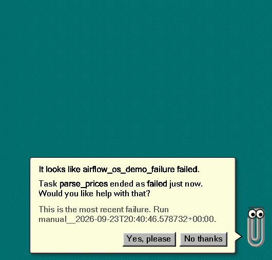
</p>

### The stop screen

```
A fatal exception 0E has occurred at 0028:C4A1B33E in DAG
airflow_os_demo_failure(01) + 00010E36. The current dag run has been terminated.

*  Failed task: parse_prices  (failed, attempt 1 of 1)
*  ValueError: could not convert string to float: 'n/a'
```

Any key returns to the desktop; **Ctrl+Alt+Del** clears the dag run so the scheduler
tries it again, which is the closest honest analogue to rebooting. Only *fresh*
failures raise it, so a database full of old ones stays quiet.

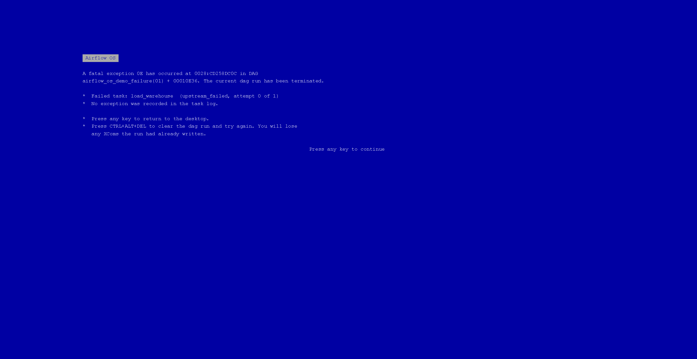

### Human Input Required

Airflow 3.1's HITL operators park a task until a person answers, which is the exact
shape of a Windows message box: a subject, some body text, and a row of buttons. So the
operator's `options` **become** the buttons.

Airflow has its own Required Actions page for these. This is not a missing feature
being filled in; it is the same requests read as what they structurally are — a modal
dialog that has stopped the machine until somebody clicks something.

All three request shapes work — a single choice, a multiple choice (checkboxes seeded
from `defaults`), and a request for values (`params`, sent back with original types
preserved). Pending count is badged on the desktop icon and in the system tray, where
Windows 95 would actually have put it.

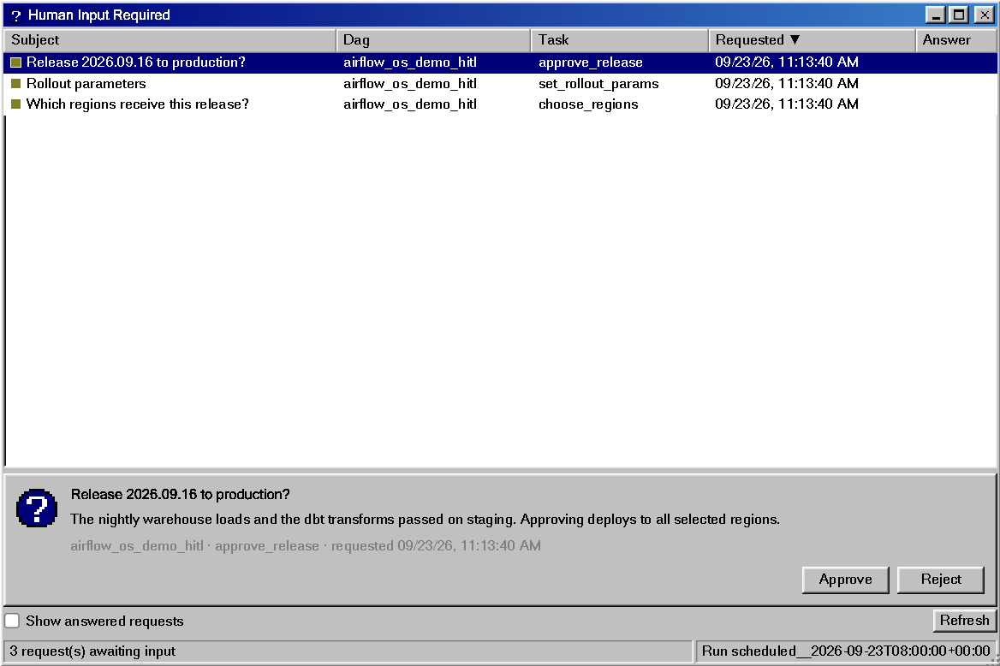

### Deadlines

You declare a deadline on a dag — *this run must finish within 30 seconds of being
queued, and call this function if it doesn't* — and the scheduler enforces it.

**The public REST API knows nothing about them.** `grep -c deadline` on the `/api/v2`
OpenAPI spec returns `0`, which is why this is the one window in Airflow OS that reads
the metadata database directly: it opens the `deadline` and `deadline_alert` tables
because there is no endpoint to ask instead. Airflow's own UI reaches them through a
private route that is not part of the public API surface.

What the mailbox adds is the reading, not the access. A deadline is a promise about
time that something either kept or broke, which is mail: a missed one arrives bold with
its flag up, and the count sits on the desktop icon until you look.

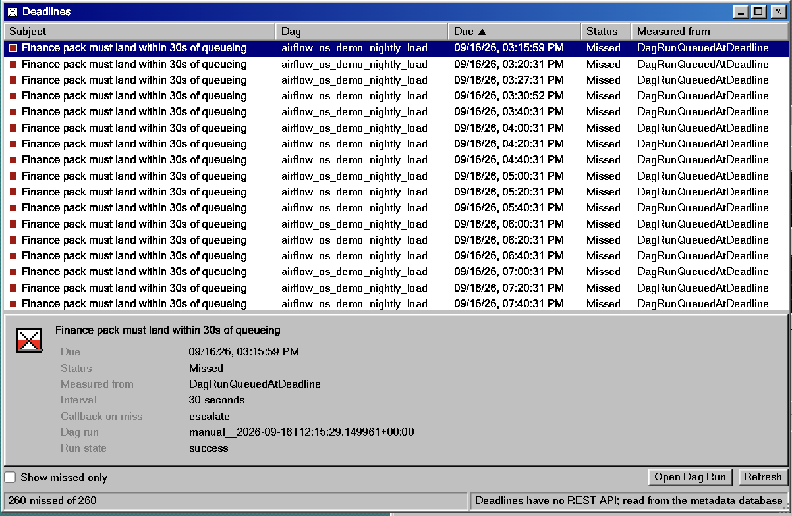

### Recycle Bin

Airflow already behaves like one and nobody notices. Deleting a dag file does not drop
the record — the scheduler sets `DagModel.is_stale` and keeps everything: the runs, the
logs, the XComs. Put the file back and it all comes home.

**Restore** is honest about being impossible, and **Empty Recycle Bin** drops the stale
records for real, refusing any dag whose file is still present.

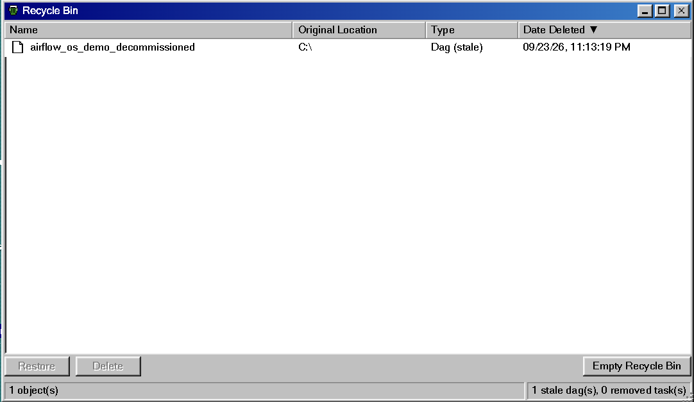

### Control Panel

Five applets, and three of them are Airflow's own furniture under a different name.

| Applet | Is |
| --- | --- |
| **System (Pools)** | The memory manager. Slots in use against total, and whether the pool counts deferred tasks |
| **Registry (Variables)** | Keys, descriptions and whether each is encrypted |
| **Dial-Up Networking** | Connections: type, host, schema, login, port |
| **Sounds** | The scheme, with every sound auditionable |
| **Display** | Whether a failed task raises the stop screen, and a **Test** button that raises one on demand |

Read-only, deliberately. Editing a Connection belongs in Airflow's own UI, where the
audit trail is. And the two applets that show secrets do not: **Variable values and
Connection passwords and `extra` are dropped in the kernel and never sent to the
browser at all.** The REST API will hand a sufficiently privileged caller all three;
Control Panel lists names and shapes, so it throws them away before they leave the
api-server.

### Event Viewer

Airflow's audit log, in the window Windows kept it in: a list nobody reads until
something breaks, and then the only thing worth reading. Who triggered that dag run,
who cleared that task, who answered that human-in-the-loop request. Filterable, and
it refreshes on its own.

### Airflow Help

A dag is a book, its tasks are the pages. Renders the `doc_md` you have already
written. Tasks load only when a book is opened, because a deployment can hold hundreds
of dags.

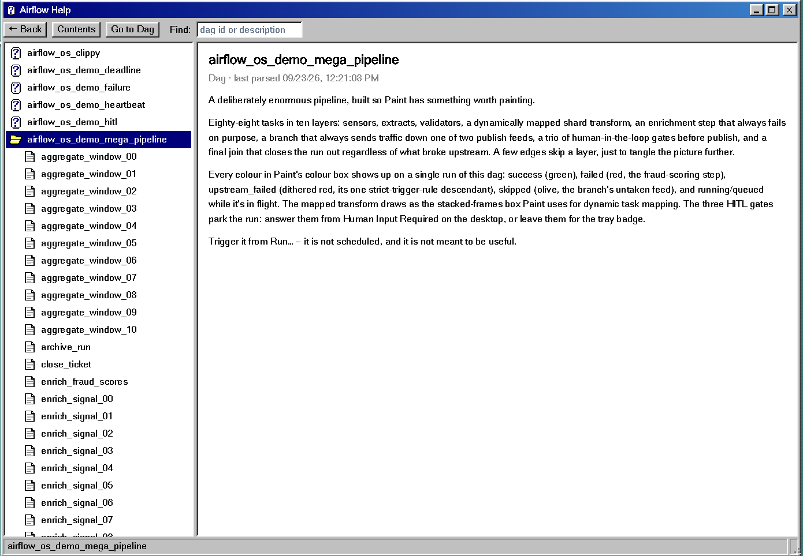

### Paint

The dag graph, as a bitmap. Tasks are pixel boxes laid out in dependency order, edges
are 1px lines with arrowheads, and every box is filled with the colour of its task
instance in the run being shown. A task that has not run is still white. Unpainted.

The colour box **is** the legend. `upstream_failed` and `up_for_retry` are dithered
with white, the way Paint faked colours it did not have, and a mapped task is a stack
of frames with its instance count. Running tasks get marching ants.

The tools are honest about what Paint can do to Airflow:

| Tool | Does |
| --- | --- |
| Select | Picks a task; double-click opens its log in Notepad |
| Pick Color | Reads a task's state into the colour box |
| Fill With Color | Paints a task `success`, `failed` or `skipped`, which sets its state through the REST API. White erases |
| Eraser | Clears the task instance, so the scheduler runs it again. Airflow's own Clear |
| Magnifier | 100%, 200%, 400%, with Paint's pixel grid at 400% |

The other eleven tools are drawn but disabled: there is no metadata column for a
freehand line. **Image → Flip/Rotate** turns the graph top-to-bottom, **File → Save
As** writes a real 24-bit `.bmp`, and the picture repaints itself from live task
instance state every few seconds. Open it from Accessories, from the **Paint** button in any
dag folder in Explorer, or with `paint <dag_id>` at the DOS prompt.

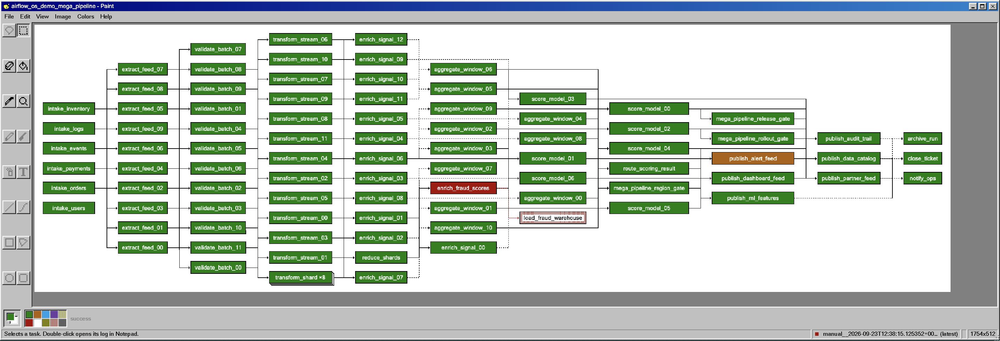

### MS-DOS Prompt

```
C:\>tasklist
Image Name                     PID    Status         Dag
============================== ====== ============== ====================
parse_prices.exe               46782  failed         airflow_os_demo_failure

C:\>kill 46782
```

`dir` `cd` `type` `tasklist` `kill` `dags` `trigger` `pause` `unpause` `mem` `ver`
`paint` `start` `cls` `help` `exit`. Reads go to the kernel API; writes go to Airflow's
public REST API, so nothing bypasses permissions.

<p align="center">
  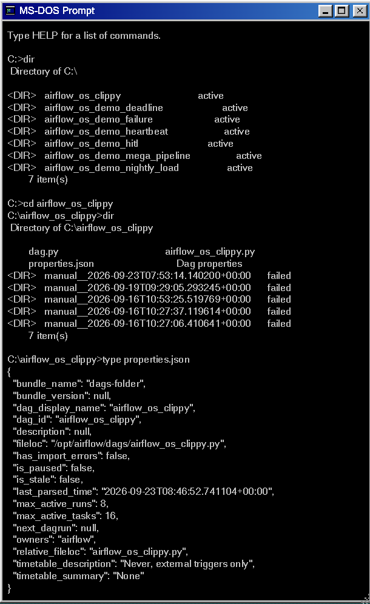
</p>

---

## Which Airflow 3 features this uses

The parts that are specific to Airflow 3, and what each one turned into. Task mapping,
pools, trigger rules, XCom and the audit log are all in here too, but they long predate
Airflow 3 and are not what this is about.

| Airflow feature | Where it shows up | In the code |
| --- | --- | --- |
| **Plugin external views** — `fastapi_apps` + `react_apps` (3.1) | The whole desktop: a mounted FastAPI app and a dynamically imported React bundle, with a nav entry | `src/airflow_os/plugin.py` |
| **Human-in-the-loop operators** (3.1) — `ApprovalOperator`, `HITLOperator`, `HITLEntryOperator` | Human Input Required. The operator's `options` *become* the message-box buttons; all three request shapes work | `dags/airflow_os_demo_hitl.py` |
| **Deadlines** — `DeadlineAlert`, `DeadlineReference.DAGRUN_QUEUED_AT`, `AsyncCallback` | The Deadlines mailbox. The public REST API has no deadline endpoints, so this is the only view in the plugin that reads the metadata database | `dags/airflow_os_demo_deadline.py`, `src/airflow_os/kernel.py` |
| **`@task.llm`** via the Common AI provider | Clippy. Triage runs as a real dag you can watch in Task Manager, so the reasoning is logged, retryable and auditable | `dags/airflow_os_clippy.py` |
| **REST API v2, with the `~` wildcard** | Nearly every read. `/dags/~/dagRuns/~/taskInstances` is the process table; `/dags/~/dagRuns/~/hitlDetails` is the inbox | `src/airflow_os/rest.py` |
| **`DagModel.is_stale`** | The Recycle Bin. Deleting a dag file keeps the record and all its history | `src/airflow_os/kernel.py` |
| **Task SDK boundary** | The constraint that shaped Clippy: task code has neither database access nor a credential of its own, so evidence is gathered in the api-server and passed in `dag_run.conf` | `dags/airflow_os_clippy.py` |

---

## Install

```bash
./scripts/build.sh          # build the React bundle and stage it into the package
pip install -e .            # registers via the `airflow.plugins` entry point
airflow api-server          # restart so the plugin is picked up
```

Then open **Airflow OS** in the Airflow nav, or go straight to `/airflow-os`.

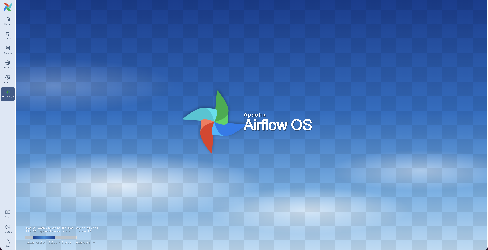

### Or run it in Docker

If a different Airflow already lives on this machine, run Airflow OS in its own
container instead. It needs nothing but Docker: the image builds the React bundle,
installs the plugin into the official `apache/airflow` image and boots
`airflow standalone` on SQLite, published on **28080** so it cannot collide with an
Airflow on 8080.

```bash
docker compose up --build -d        # first build takes a few minutes
open http://localhost:28080         # log in with admin / admin, then open Airflow OS
docker compose logs -f              # scheduler and api-server output
docker compose down                 # stop; the metadata db and logs persist in a volume
docker compose down -v              # stop and start from scratch next time
```

`./dags` is bind-mounted, so editing a demo dag needs no rebuild. Python or UI changes
do: `docker compose up --build -d` again. Settings, all optional, go in the shell or a
`.env` file next to `docker-compose.yml`:

| Variable | Default | |
| --- | --- | --- |
| `AIRFLOW_OS_PORT` | `28080` | Host port |
| `AIRFLOW_OS_ADMIN_PASSWORD` | `admin` | Applied on first boot only; edit `passwords.json` in the volume afterwards |
| `ANTHROPIC_API_KEY` | unset | If set, becomes the `anthropic_default` connection so Clippy works out of the box |
| `AIRFLOW_OS_SEED_DEMO` | `true` | Seeds 20 Variables, 33 Connections and 8 Pools with realistic names and random values on first boot, so Control Panel is not empty. Re-roll with `docker compose exec airflow-os bash /seed.sh --force` |
| `AIRFLOW_IMAGE` | `apache/airflow:3.3.1-python3.12` | Base image, to try another Airflow release |
| `AIRFLOW_OS_JWT_SECRET` | a fixed dev value | Token signing key; change it if the box is reachable by others |
| `AIRFLOW_OS_FERNET_KEY` | a fixed dev value | Encrypts Connections and Variables. Pinned because `airflow standalone` writes a generated key into `airflow.cfg`, which is not in the data volume — so a rebuilt container would otherwise get a new key and be unable to decrypt its own secrets |

Without Compose: `docker build -t airflow-os . && docker run --rm -p 28080:8080 airflow-os`.

### Clippy needs a model

The generic `pydanticai` conn type works for Anthropic — the hook passes
`conn.password` to whichever provider the model string names:

```bash
airflow connections add anthropic_default \
  --conn-type pydanticai \
  --conn-password "$ANTHROPIC_API_KEY"
```

Override with Airflow Variables (read through Jinja, so the lookup happens per task run
rather than on every dag-processor parse loop):

```bash
airflow variables set airflow_os_llm_conn_id  my_llm_conn
airflow variables set airflow_os_llm_model_id "anthropic:claude-sonnet-5"
```

Without a connection Clippy degrades honestly: he still gathers and reports the
evidence, and says the model call could not be made.

### Running on a non-default port

If you move the api-server off 8080, move the **Task Execution API** with it, or every
task dies before writing a log line:

```bash
export AIRFLOW__API__PORT=28080
export AIRFLOW__API__BASE_URL=http://localhost:28080
export AIRFLOW__CORE__EXECUTION_API_SERVER_URL=http://localhost:28080/execution/
```

The symptom is distinctive: tasks go straight to `failed` with a log of a few hundred
bytes containing only `Pre Execute`, and the scheduler logs
`httpcore.ConnectError: [Errno 61] Connection refused`.

## Architecture

~2,300 lines of Python, ~9,400 of TypeScript. Nothing patches or forks Airflow.

```
pip install -e .
   └─ pyproject entry point:  [airflow.plugins] airflow_os = "airflow_os.plugin:AirflowOSPlugin"
        └─ api-server imports the plugin and reads two attributes:

           fastapi_apps →  mounts the kernel API + built bundle at /airflow-os
           react_apps   →  the core UI dynamically imports the bundle and renders
                           the desktop full-page, with a nav entry
```

### The kernel is shape, not data

The desktop asks questions Airflow's API does not have a window for — *every in-flight
task instance*, *what is waiting on a human anywhere*, *this dag run as a folder of
files*. The kernel answers them, but it does not go to the database to do it. It calls
Airflow's own REST API, **with the caller's own credential**, and arranges the answers
into the shape a Win95 window needs.

| | Kernel API (`/airflow-os`) | Airflow REST API (`/api/v2`) |
| --- | --- | --- |
| For | deployment-wide roll-ups, and the synthetic filesystem | anything already shaped the way the desktop needs it |
| 14 endpoints | `/processes`, `/performance`, `/system`, `/fs/*`, `/hitl`, `/deadlines`, `/recycle-bin`, `/evidence`, `/control-panel` | triggering, clearing, task logs, audit events, HITL responses |
| Called | in-process in the api-server, which then calls `/api/v2` over loopback | straight from the browser |

The thing that makes this work is one character. `~` stands in for a dag id or a run id,
so `/dags/~/dagRuns/~/taskInstances` is the whole deployment's process table in one
request, and `/dags/~/dagRuns/~/hitlDetails` is the inbox. The kernel pages through
those, joins in what the row is missing, and returns `ProcessRow`s.

**Why route reads through the API rather than the database it is sitting next to:**
Airflow's permission model then applies itself. A caller scoped to three dags gets three
dags because `/api/v2` says so, not because the plugin remembered to filter. Dag source
is withheld from someone who cannot read every dag the file defines by the endpoint that
invented that rule. And nothing breaks when `TaskInstance` grows a column, because the
process table, the filesystem and the inbox never touch the ORM at all.

**One thing still reads the database, because nothing else can: deadlines.** There are
no deadline endpoints. That is why the mailbox is the only place in any Airflow UI where
a deadline is visible, and it is the only reason the kernel still opens a session.

Writes go through `/api/v2` too. **End Process** patches one task instance to `failed`
with every cascade flag off, so nothing downstream moves. **Empty Recycle Bin** checks
`is_stale` and then calls `DELETE /api/v2/dags/{dag_id}`; a dag whose file is still
present is refused, because deleting its history because the desktop asked would be
indefensible. Triggering, clearing and answering a HITL request go straight from the
browser. All of it inherits Airflow's validation and audit trail.

Secrets are dropped on the way through. `/api/v2` will hand a privileged caller a
connection's password and `extra` and a variable's value; Control Panel lists names and
shapes, so it discards them rather than sending them to a browser that has no use for
them.

### No UI dependencies

No React95, no styled-components, no component library, no icon set, no markdown
library, no query library. The window manager, the 1,298 lines of Win95 CSS, the 34
pixel icons, the sound scheme and the Markdown renderer are all first-party — which
keeps the dynamically-imported bundle at **160 kB** (46 kB gzipped) and avoids shipping
a second CSS-in-JS runtime alongside the host's Emotion.

The Markdown renderer emits React elements rather than an HTML string. That is a
security decision: `doc_md` is authored by whoever writes the dag, and injecting it as
HTML would hand them a script tag in another user's Airflow session.

---

## Licence

Apache License 2.0. Apache Airflow® is a trademark of The Apache Software Foundation;
this project is an independent plugin.
