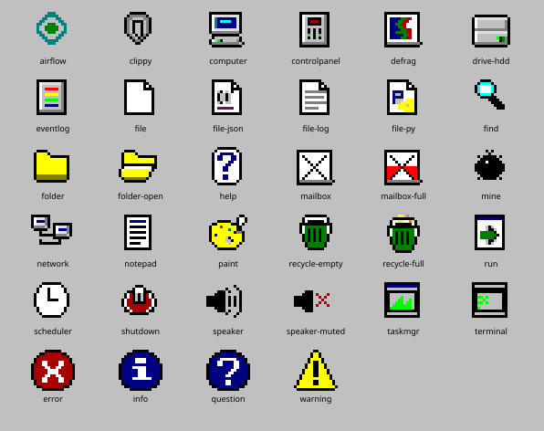

<div align="center">


# Airflow OS

**A Windows 95 desktop for Apache Airflow 3.1+, shipped as a native plugin.**

Every pixel is live metadata. Nothing here is simulated.

[](https://airflow.apache.org)
[](LICENSE)
[](https://python.org)

</div>

---

## The idea

Windows 95 and Airflow already have the same shape. Once you see it, the desktop stops
being a skin over Airflow and becomes a *reading* of it.

| Windows 95 | Airflow |
| --- | --- |
| Process | Task instance |
| PID | `TaskInstance.pid`, or a stable synthetic id |
| CPU usage | Running slots / `core.parallelism` |
| Memory usage | Occupied pool slots / total pool slots — pools *are* a bounded resource tasks contend for |
| Priority class | `priority_weight`, bucketed into Realtime…Low |
| Drive `C:` | The dag bundle |
| Folders | Dag → dag run → task instance |
| Files | Task logs, XCom values, rendered properties |
| Control Panel | Variables, Connections, Pools |
| Event Viewer | The audit log |
| Message box | A human-in-the-loop request |
| Unread mail | A missed deadline |
| Recycle Bin | Stale dags and removed task instances |
| Help book | A dag's `doc_md`; its pages are the tasks |
| Paint | The dag graph: tasks are boxes, their colour is the task instance state |
| Blue screen | A task that just failed |

---

## What's on the desktop

### Task Manager

Ctrl+Alt+Del for your scheduler. **Applications** are dag runs, **Processes** are task
instances, **Performance** graphs parallelism and pool-slot utilisation.

The CPU column is real: it is how far through its own historical mean duration a task
has got, so a task 30 seconds into a job that normally takes 60 reads as 50%. Tasks
with no history report nothing rather than a guess.

**End Process** fails the task instance — and deliberately does not cascade to
downstream tasks, because Windows 95 did not ask permission either.

### Explorer, and Notepad

The metadata database as a drive:

```
C:\<dag_id>\<run_id>\<task_id>\{stdout.log, xcom\, details.json}
```

Folders are dags, runs and task instances; files are logs, XCom values and rendered
properties. Double-click a log and it opens in Notepad, streamed from the public REST
API so it inherits whatever log handler the deployment configured.

### Clippy

> *"It looks like airflow_os_demo_failure failed. Would you like help with that?"*

Clippy watches the process table and offers to triage the most recent failure.
Accepting triggers the `airflow_os_clippy` dag — **a real dag run you can watch in Task
Manager while he thinks** — which is one `@task.llm` step using the Common AI provider.
The reasoning happens inside Airflow, so it is logged, retryable and auditable like any
other task.

He returns a headline, the likely cause, a suggested fix and a confidence, and refuses
to invent a cause the log does not support.

### The stop screen

```
A fatal exception 0E has occurred at 0028:C4A1B33E in DAG
airflow_os_demo_failure(01) + 00010E36. The current dag run has been terminated.

*  Failed task: parse_prices  (failed, attempt 1 of 1)
*  ValueError: could not convert string to float: 'n/a'
```

Any key returns to the desktop; **Ctrl+Alt+Del** clears the dag run so the scheduler
tries it again, which is the closest honest analogue to rebooting. Only *fresh*
failures raise it, so a database full of old ones stays quiet.

### Human Input Required

Airflow 3.1's HITL operators park a task until a person answers, which is the exact
shape of a Windows message box: a subject, some body text, and a row of buttons. So the
operator's `options` **become** the buttons.

All three request shapes work — a single choice, a multiple choice (checkboxes seeded
from `defaults`), and a request for values (`params`, sent back with original types
preserved). Pending count is badged on the desktop icon and in the system tray, where
Windows 95 would actually have put it.

### Deadlines

Airflow 3 deadlines are the feature nobody can see. You declare one on a dag — *this
run must finish within 30 seconds of being queued, and call this function if it
doesn't* — and the scheduler enforces it. But **deadlines have no REST API at all**
(`grep -c deadline` on the OpenAPI spec returns `0`), so no UI anywhere displays them.

The mailbox reads the `deadline` and `deadline_alert` tables through the kernel, which
makes this window the only place a deadline is visible. A missed deadline is unread
mail: bold, flag up.

### Recycle Bin

Airflow already behaves like one and nobody notices. Deleting a dag file does not drop
the record — the scheduler sets `DagModel.is_stale` and keeps everything: the runs, the
logs, the XComs. Put the file back and it all comes home.

**Restore** is honest about being impossible, and **Empty Recycle Bin** drops the stale
records for real, refusing any dag whose file is still present.

### Airflow Help

A dag is a book, its tasks are the pages. Renders the `doc_md` you have already
written. Tasks load only when a book is opened, because a deployment can hold hundreds
of dags.

### Paint

The dag graph, as a bitmap. Tasks are pixel boxes laid out in dependency order, edges
are 1px lines with arrowheads, and every box is filled with the colour of its task
instance in the run being shown. A task that has not run is still white. Unpainted.

The colour box **is** the legend. `upstream_failed` and `up_for_retry` are dithered
with white, the way Paint faked colours it did not have, and a mapped task is a stack
of frames with its instance count. Running tasks get marching ants.

The tools are honest about what Paint can do to Airflow:

| Tool | Does |
| --- | --- |
| Select | Picks a task; double-click opens its log in Notepad |
| Pick Color | Reads a task's state into the colour box |
| Fill With Color | Paints a task `success`, `failed` or `skipped`, which sets its state through the REST API. White erases |
| Eraser | Clears the task instance, so the scheduler runs it again. Airflow's own Clear |
| Magnifier | 100%, 200%, 400%, with Paint's pixel grid at 400% |

The other eleven tools are drawn but disabled: there is no metadata column for a
freehand line. **Image → Flip/Rotate** turns the graph top-to-bottom, **File → Save
As** writes a real 24-bit `.bmp`, and the picture repaints itself from the metadata
database every few seconds. Open it from Accessories, from the **Paint** button in any
dag folder in Explorer, or with `paint <dag_id>` at the DOS prompt.

### MS-DOS Prompt

```
C:\>tasklist
Image Name                     PID    Status         Dag
============================== ====== ============== ====================
parse_prices.exe               46782  failed         airflow_os_demo_failure

C:\>kill 46782
```

`dir` `cd` `type` `tasklist` `kill` `dags` `trigger` `pause` `unpause` `mem` `ver`
`paint` `start` `cls` `help` `exit`. Reads go to the kernel API; writes go to Airflow's
public REST API, so nothing bypasses permissions.

---

## The icons

All 34 icons are hand-drawn pixel art — no icon set, no image files. Each is a 16×16
character grid mapped through a shared palette and emitted as `<rect>` runs, so they
stay crisp at any size and can be recoloured in code.



```
"................",
"..kkkk..........",     k = outline    y = folder yellow
".kyyyyk.........",     Y = shade      . = transparent
".kyyyyykkkkkkk..",
".kyyyyyyyyyyyk..",
"..kkkkkkkkkkk...",
```

## The sound scheme

Nine sounds, all synthesised from Web Audio oscillators at play time. **There is not a
single audio file in this repository** — the host UI dynamically imports this bundle,
and a megabyte of base64 WAV in it would be rude.

| Event | Sound |
| --- | --- |
| The boot splash is up | air: four noise bands sweeping upward, the gust that turns the pinwheel |
| The desktop appears | a logon click — a switch closing, not a chime |
| A task instance succeeds | ta-da |
| A task instance fails | Critical Stop, four notes falling away |
| A dag run is triggered | dial-up: three real DTMF tones, then a carrier over filtered noise |
| Dialogs | Asterisk, Exclamation or Question, by severity |
| Shutdown | the startup chord, reversed |

Task sounds fire on **transitions**, not absolute state, so a backlog of old failures
stays quiet, and at most one plays per poll so a mapped-task fan-out sounds like an
event rather than an avalanche. Toggle from the speaker in the tray, or audition
everything in **Control Panel → Sounds**.

---

## Install

```bash
./scripts/build.sh          # build the React bundle and stage it into the package
pip install -e .            # registers via the `airflow.plugins` entry point
airflow api-server          # restart so the plugin is picked up
```

Then open **Airflow OS** in the Airflow nav, or go straight to `/airflow-os`.

### Or run it in Docker

If a different Airflow already lives on this machine, run Airflow OS in its own
container instead. It needs nothing but Docker: the image builds the React bundle,
installs the plugin into the official `apache/airflow` image and boots
`airflow standalone` on SQLite, published on **28080** so it cannot collide with an
Airflow on 8080.

```bash
docker compose up --build -d        # first build takes a few minutes
open http://localhost:28080         # log in with admin / admin, then open Airflow OS
docker compose logs -f              # scheduler and api-server output
docker compose down                 # stop; the metadata db and logs persist in a volume
docker compose down -v              # stop and start from scratch next time
```

`./dags` is bind-mounted, so editing a demo dag needs no rebuild. Python or UI changes
do: `docker compose up --build -d` again. Settings, all optional, go in the shell or a
`.env` file next to `docker-compose.yml`:

| Variable | Default | |
| --- | --- | --- |
| `AIRFLOW_OS_PORT` | `28080` | Host port |
| `AIRFLOW_OS_ADMIN_PASSWORD` | `admin` | Applied on first boot only; edit `passwords.json` in the volume afterwards |
| `ANTHROPIC_API_KEY` | unset | If set, becomes the `anthropic_default` connection so Clippy works out of the box |
| `AIRFLOW_OS_SEED_DEMO` | `true` | Seeds 20 Variables, 33 Connections and 8 Pools with realistic names and random values on first boot, so Control Panel is not empty. Re-roll with `docker compose exec airflow-os bash /seed.sh --force` |
| `AIRFLOW_IMAGE` | `apache/airflow:3.3.1-python3.12` | Base image, to try another Airflow release |
| `AIRFLOW_OS_JWT_SECRET` | a fixed dev value | Token signing key; change it if the box is reachable by others |

Without Compose: `docker build -t airflow-os . && docker run --rm -p 28080:8080 airflow-os`.

### Clippy needs a model

The generic `pydanticai` conn type works for Anthropic — the hook passes
`conn.password` to whichever provider the model string names:

```bash
airflow connections add anthropic_default \
  --conn-type pydanticai \
  --conn-password "$ANTHROPIC_API_KEY"
```

Override with Airflow Variables (read through Jinja, so the lookup happens per task run
rather than on every dag-processor parse loop):

```bash
airflow variables set airflow_os_llm_conn_id  my_llm_conn
airflow variables set airflow_os_llm_model_id "anthropic:claude-sonnet-5"
```

Without a connection Clippy degrades honestly: he still gathers and reports the
evidence, and says the model call could not be made.

### Demo dags

| Dag | Schedule | For |
| --- | --- | --- |
| `airflow_os_demo_failure` | manual | A price feed where one vendor reports `"n/a"` — a real `ValueError` for the stop screen and Clippy |
| `airflow_os_demo_deadline` | manual | Deliberately slower than its own 30-second deadline |
| `airflow_os_demo_nightly_load` | every 20 min | The scheduled version: a missed deadline per interval, so the mailbox keeps filling |
| `airflow_os_demo_hitl` | hourly | Three human-in-the-loop requests at once, one per request shape. Defaults and a 55-minute timeout keep it from failing when nobody answers |
| `airflow_os_demo_heartbeat` | `@continuous` | Three mapped shards always polling, so Task Manager always has processes with an honest CPU column |
| `airflow_os_clippy` | manual | The triage dag itself |

The Docker container triggers the manual failure dag and the HITL dag once on first
boot, so every icon has something behind it before you open the desktop.

### Running on a non-default port

If you move the api-server off 8080, move the **Task Execution API** with it, or every
task dies before writing a log line:

```bash
export AIRFLOW__API__PORT=28080
export AIRFLOW__API__BASE_URL=http://localhost:28080
export AIRFLOW__CORE__EXECUTION_API_SERVER_URL=http://localhost:28080/execution/
```

The symptom is distinctive: tasks go straight to `failed` with a log of a few hundred
bytes containing only `Pre Execute`, and the scheduler logs
`httpcore.ConnectError: [Errno 61] Connection refused`.

## Develop

```bash
cd ui && pnpm install && pnpm dev    # :5173, proxies /airflow-os and /api/v2 to :28080
```

Point it elsewhere with `AIRFLOW_OS_API_URL`. **System Properties** shows the bundle's
build time next to the server's, so a browser serving a cached bundle says so instead
of looking like a missing feature.

```bash
cd ui && pnpm test                   # vitest: Paint's layout, palette and bitmap encoder, the menu bar
docker compose exec airflow-os pytest /opt/airflow-os/tests         # pytest: kernel helpers and permission filtering
AIRFLOW_OS_URL=http://localhost:28080 pytest tests/integration      # smoke test over HTTP
```

The Python tests run inside the container because that is where a real Airflow and a
populated metadata database are. The permission tests hand the kernel an allow-list of
one dag and assert nothing else appears in any listing, file or row-level view.

---

## Architecture

~2,200 lines of Python, ~9,100 of TypeScript. Nothing patches or forks Airflow.

```
pip install -e .
   └─ pyproject entry point:  [airflow.plugins] airflow_os = plugin:AirflowOSPlugin
        └─ api-server imports the plugin and reads two attributes:

           fastapi_apps →  mounts the kernel API + built bundle at /airflow-os
           react_apps   →  the core UI dynamically imports the bundle and renders
                           the desktop full-page, with a nav entry
```

### Two backends, on purpose

| | Kernel API (`/airflow-os`) | Airflow REST API (`/api/v2`) |
| --- | --- | --- |
| For | aggregate views Airflow does not model | anything Airflow already models well |
| 14 endpoints | `/processes`, `/performance`, `/system`, `/fs/*`, `/hitl`, `/deadlines`, `/recycle-bin`, `/evidence`, `/control-panel` | triggering, clearing, task logs, audit events, HITL responses |
| Runs | in-process in the api-server, reading the metadata DB | over HTTP from the browser |

Reads needing a deployment-wide roll-up go to the kernel, because the core API is
scoped per dag run and cannot answer *"every in-flight task instance"* or *"what is
waiting on a human anywhere"*.

**Every write goes through `/api/v2`**, so triggering, clearing and answering a HITL
request inherit Airflow's validation, permissions and audit trail rather than
reimplementing them.

### Two rules in the kernel

**Never load ORM entities on a read path — name the columns.** `TaskInstance` grows
columns between minor releases and eagerly joins `dag_run`; selecting the entity breaks
against any database one migration behind.

**Filter every row-level view by `get_authorized_dag_ids(user)`.** `requires_access_dag`
with no `dag_id` only asks *"can you read dags at all"*, so without this a user scoped
to three dags would see all of them. Dag source additionally requires
`DagAccessEntity.CODE` and is withheld when the file defines any dag the caller cannot
read; XCom values require `XCOM`. Connection passwords and `extra`, and Variable
values, are never sent to the browser at all.

### What Airflow 3 dictated

The most instructive constraint: **task code has no metadata DB access**.
`create_session()` in a task raises `Session must be set before!`, because tasks run
under the Task SDK and reach the scheduler over the Task Execution API.

That is why Clippy is shaped the way it is. The plugin — in the api-server, which does
have DB access and can check `TASK_LOGS` permission — gathers the evidence; the desktop
passes it to the dag in `dag_run.conf`; the dag is purely the `@task.llm` call. The
agentic step lives where it is auditable, and the query lives where queries are
allowed.

### No UI dependencies

No React95, no styled-components, no component library, no icon set, no markdown
library, no query library. The window manager, the 1,298 lines of Win95 CSS, the 34
pixel icons, the sound scheme and the Markdown renderer are all first-party — which
keeps the dynamically-imported bundle at **160 kB** (46 kB gzipped) and avoids shipping
a second CSS-in-JS runtime alongside the host's Emotion.

The Markdown renderer emits React elements rather than an HTML string. That is a
security decision: `doc_md` is authored by whoever writes the dag, and injecting it as
HTML would hand them a script tag in another user's Airflow session.

---

## Licence

Apache License 2.0. Apache Airflow® is a trademark of The Apache Software Foundation;
this project is an independent plugin.
